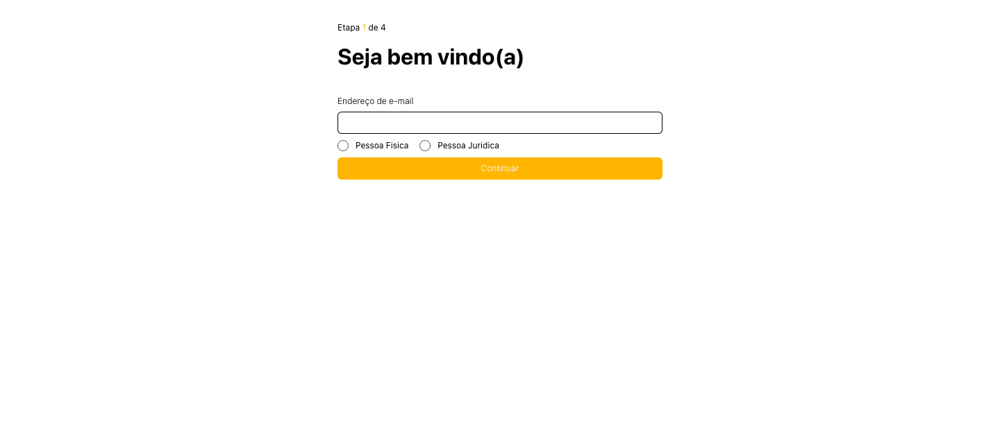
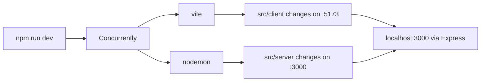

# Desafio MB Web - [DEMO](https://desafio-mb-bruna.vercel.app/)

Este projeto faz parte do desafio técnico da Mercado Bitcoin e tem como objetivo criar uma aplicação para cadastro de usuários.



## Tecnologias Utilizadas

### Frontend:

- Vue.js
- Vite
- SCSS

### Backend:

- Node.js
- Express

## Estrutura do Projeto

O projeto está estruturado da seguinte maneira:

```sh
.
├── public
│   └── favicon.ico
├── src
│   ├── client # Frontend files (Vue)
│   │   ├── assets
│   │   │   └── styles
│   │   │       ├── global.scss
│   │   │       ├── mixins.scss
│   │   │       └── variables.scss
│   │   ├── components
│   │   │   ├── Button.vue
│   │   │   ├── Header.vue
│   │   │   ├── InputField.vue
│   │   │   ├── InputGroup.vue
│   │   │   ├── InputRadio.vue
│   │   │   └── Message.vue
│   │   ├── helpers
│   │   │   └── validations.js
│   │   ├── views
│   │   │   ├── EntityInfo.vue
│   │   │   ├── Password.vue
│   │   │   ├── Review.vue
│   │   │   └── Welcome.vue
│   │   ├── App.vue
│   │   ├── main.js
│   │   └── style.scss
│   └── server # Backend Files (Express)
│       ├── routes
│       │   └── registration.js # API Routes (GET/POST)
│       └── index.js
├── README.md
├── index.hmr.html # Used for hot module replacement in development
├── index.html # Used for production
├── package-lock.json
├── package.json
├── vercel.json
└── vite.config.js
```

## Como Executar

Para rodar o projecto, você precisa ter o Node.js instalado e rodar os seguintes comandos:

```bash
npm install
npm run dev
```

O comando `npm run dev` irá inicializar o Vite e o Express de forma paralela rodando através do `concurrently`, podendo ser acessado através do `http://localhost:3000`. Segue abaixo o fluxograma do funcionamento:



## Provisionamento do Vite via Express

Esse projeto roda com o Vite e o Express, o Vite gerando os assets do front e o Express servindo esses arquivos e também a API.

Para ter uma boa experiência de desenvolvimento (DX), é aproveitado o Hot Reload do Vite mas ainda assim, servindo via Express. Para isso acontecer, utilizamos 2 arquivos `index`, um para desenvolvimento e um para produção.

- `index.hmr.html`: esse é o arquivo usado para desenvolvimento que posso os scripts ligando ao `localhost:5173` do Vite.
- `index.html`: esse é o arquivo original que o Vite utiliza para gerar dentro da `dist` no processo de build.
